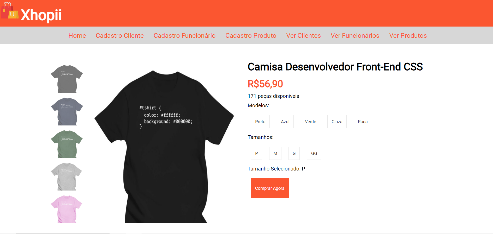

Atividade para utilizar os conhecimentos passados nas aulas A01 à A04, sendo estritamente questões que exigiam programação Front-End. Segue à lista de exercícios abaixo:

1)Implemente o MENU no site da EVENTO Fatec. Seu menu deveser inserido na tag `<nav>`e possuir   os   seguintes   itens   de   menu:   Home,   Sobre,   Inscrições,   Cronograma, Patrocinadores.    Os    itens    de    menu    devem    estar    centralizados    verticalmente    e horizontalmente. (10% da nota)

2)Implemente um formulário de inscriçãona página de Evento Fatec desenvolvida nas aulas anteriores.  Centralize  o  formulário  no  centro  da  página  de  conteúdo. Seu  formulário  de inscrição deve conter os seguintes itens de formulário: (10% da nota)✓Nome  completo, Cpf, Gênero  (Feminino,  Masculino, Outro), Data  Nascimento, Telefone, E-mail, Endereço. Botão para enviar o formulário.

3)Implemente um Site que represente seu Currículo Vitae. Replique o site a seguir com os seus  dados  e  informações  adicionais  que  quiser  inserir.  Utilize  todos  os  conhecimentos adquiridos na aula 2, utilize FlexBox.(20% da nota)

4)Implemente uma  página  de  visualização  de  produto  de  um  site  de  E-commerce. Replique a página ilustrada abaixo exatamente como o design é apresentado. Obs: utilize os arquivos de imagem disponíveis na plataforma teams.(60% da nota)

